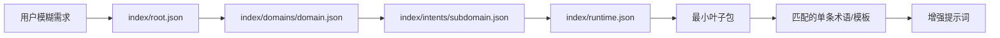

<div align="center">

# Jargon

### Jargon，你说感觉，Jargon 帮你专业术语补全。

<p>
  
  
  
  
  <a href="LICENSE"></a>
</p>

<p>
  <a href="#快速开始">快速开始</a> ·
  <a href="#渐进式索引">渐进式索引</a> ·
  <a href="#按需查询">按需查询</a> ·
  <a href="#添加新领域">添加新领域</a>
</p>

</div>

## 它能做什么

你知道自己想要什么，但不知道怎么说得专业？Jargon 会识别需求所属领域，按需加载术语，把“有质感”“稳定”“高级”“专业一点”等模糊表达扩展成更具体、更可执行的提示词。

Jargon 不替你决定方向。它把专业选项翻译成容易理解的语言，再让你选择真正重要的取舍。

| 你说 | Jargon 帮你补全 |
|---|---|
| 做一个有质感的网站 | 信息密度、字体层级、对比度、留白节奏、组件一致性 |
| 做一个稳定的大型后端 | 高可用、流量模型、水平扩展、幂等、熔断、可观测性 |
| 做一个电影感的视频 | 景别、光线、构图、色调、运动、画幅比例、声音 |
| 做一个高级感 Dashboard | 底色、强调色、布局层级、材质、内容主角 |

## 快速开始

推荐使用 `npx`，它适用于 Claude Code、Cursor、Codex、OpenCode 等 Agent 工具：

```bash
npx skills add https://github.com/konglong87/jargon
```

指定平台或只安装本 Skill：

```bash
npx skills add https://github.com/konglong87/jargon --skill jargon --agent claude-code
npx skills add https://github.com/konglong87/jargon --skill jargon --agent cursor
npx skills add https://github.com/konglong87/jargon --skill jargon --agent codex
npx skills add https://github.com/konglong87/jargon --skill jargon --agent opencode
```

查看可用 Skill、全局安装：

```bash
npx skills add https://github.com/konglong87/jargon --list
npx skills add https://github.com/konglong87/jargon -g
```

安装后可以直接说：

```text
删除列表项，5 秒内撤销并支持键盘；撤销时要沿原路径回来。
```

## 渐进式索引

> **索引越来越细，加载越来越少，术语越来越专，LLM 才能真正做到按需增强，而不是把整个知识库塞进上下文。**

Jargon 的运行路径固定为：

```text
根领域 → 专业子域 → 用户意图 → 叶子包 → 单条术语/技巧/模板
```



根索引会声明加载上限：

```json
{
  "max_subdomains": 3,
  "max_intents": 3,
  "max_intents_scope": "per_subdomain",
  "max_leaf_packages": 8,
  "max_entries_per_leaf": 30
}
```

因此，一个“撤销条 + 键盘可用”的请求只会加载交互动效和可访问性相关叶子包，不会加载所有 UI、AIGC 或后端知识。

当前已建立：

- 19 个根领域入口
- 99 个可独立加载的叶子包
- 5 级加载协议
- 7 种知识类型：术语、模式、技巧、规范、参数、模板、平台研究
- 非空运行时索引和本地查询器

## 按需查询

在仓库根目录运行：

```bash
python3 scripts/query-index.py "删除列表项，5 秒内撤销并支持键盘"
python3 scripts/query-index.py "设计一个不模板化的 AI 数据后台"
python3 scripts/query-index.py "把这个角色做成毛绒玩偶和周边"
python3 scripts/query-index.py "GPUIX 能不能跑移动端？"
```

查询结果会输出：

- 命中的子域和叶子包
- 实际加载的文件路径
- 匹配的术语/技巧/模板条目
- `provider-specific` 和 `do_not_generalize` 等边界标记
- 本次是否触发网络搜索（默认不搜索）

## 内容分层

### UI/UX

覆盖撤销条、FLIP 反向归位、跟随/阈值/吸附、速度继承、可中断动画、12 种基础动效、10 种连续交互与高级手势模式、Dashboard 视觉配方、5 种视觉效果、GSAP 适配边界、8 个可投喂给 AI 的组件描述，以及键盘、读屏和 `prefers-reduced-motion` 约束。

连续交互包把搜索框、FAB 面板、提交状态、图标变形、标签指示条、步进器、列表展开、FLIP 布局切换、滚动收起和全屏揭示拆成独立叶子；高级手势包覆盖按住确认、旋钮、前后对比、弧形菜单、滑动确认、长按预览、拖拽吸入、分段进度和透视轮播。每个模式都带状态机、阈值、取消路径、键盘替代和验收标准。

视觉效果包会把实现参数和性能边界一起加载：液态玻璃栏、封面取色氛围光、景深分层滚动、圆柱卷收列表、液滴粘连拖拽。每条记录同时提供性能预算、降级方案、移动端处理和减少动态策略，避免只复制视觉效果而忽略运行成本。

GSAP 适配包只在用户指定 GSAP 或项目已经使用 GSAP 时加载，覆盖 Core、Timeline、ScrollTrigger、Plugins、React 生命周期、性能和框架生命周期。它保留 provider-specific 与版本核验边界，不把工具 API 当作通用浏览器事实。

设计系统包提供 Light/Dark 活样式预览规范：色板、排印、按钮/输入框/卡片状态、token 到页面效果的映射和截图验收清单。外部预览站只作为待核验参考，不写入运行时事实。

### AIGC

保留基础 IP 和七个场景模板，并将角色一致性、图像提示词、视频镜头、材质、构图、运动、负面约束和工具适配拆成独立子域。一次请求只读取需要的模块。

### 后端与软件工程

将后端架构、高可用、高并发、扩展策略、可观测性、幂等、前端平台和跨平台渲染分开索引，避免把“稳定”“高并发”“高扩展”当成没有边界的口号。

### 平台研究

GPUIX 和 ThreeUI 内容被标记为 `platform-research`、`provider-specific`。未填写 `verified_at` 前只能当作待核验研究线索，不能泛化成所有 GPU UI 框架的事实。

## 项目结构

```text
index/
├── root.json                 # 根领域与加载上限
├── packages.json             # 兼容旧版领域术语包入口
├── domains/                  # 第二级：专业子域
├── intents/                  # 第三级：用户意图
├── leaves.json               # 第四级：叶子包清单
└── runtime.json              # 热路径运行时路由索引

terms/
├── interaction/              # 动效、撤销、跟手、阈值、吸附
├── dashboard/                # Dashboard 视觉方向
├── component-design/         # AI 可生成组件描述
├── visual-effects/            # 玻璃、光晕、景深和液态交互
├── animation-tool-adapter/   # GSAP 等动画工具适配
├── design-system/            # Light/Dark 活样式预览规范
├── character-ip/             # AIGC 角色一致性
├── platform-research/        # 平台专属研究
├── software-engineering/     # 软件架构叶子包
└── workplace/                # 职场表达与协作

templates/
├── aigc/                     # 基础 IP 与七个场景模板
├── dashboard/                # Dashboard 审美 Skill 模板

skills/jargon/SKILL.md        # Agent 加载规则
scripts/query-index.py        # 渐进式查询器
scripts/validate-index.py     # 索引一致性校验
scripts/bootstrap-progressive-content.py # 可重复生成内容与索引
```

## 添加新领域骨架 SOP

1. 在 `index/root.json` 增加根领域和 `subdomain_index`。
2. 新建 `index/domains/<domain_id>.json`，只放子域摘要和加载入口。
3. 为每个子域新建 `index/intents/<subdomain_id>.json`，只放意图和叶子引用。
4. 在 `terms/<area>/` 增加独立叶子包；每个叶子只描述一个术语、模式、技巧或模板集合。
5. 在 `index/leaves.json` 登记叶子元数据，在 `index/runtime.json` 增加关键词路由。
6. 跑校验和端到端查询：

```bash
python3 scripts/validate-index.py
python3 scripts/test-progressive-index.py
python3 scripts/query-index.py "一个真实用户请求"
```

7. 只提交公开、可复用、无密钥、无本机路径和无用户隐私的内容。

叶子 JSON 是可编辑的事实来源。运行 `scripts/bootstrap-progressive-content.py` 时，已有叶子会被读取并保留；只有缺失叶子会从内置骨架生成。确实需要用脚本内置内容覆盖已有叶子时，才显式使用：

```bash
python3 scripts/bootstrap-progressive-content.py --force
```

意图索引按 `index/intents/<domain_id>/<subdomain_id>.json` 命名，避免不同领域出现同名子域时互相覆盖。

## 卸载

```bash
npx skills list
npx skills remove jargon
npx skills remove jargon -g
npx skills remove jargon --agent cursor
```

若安装器参数发生变化，请以 `npx skills --help` 的当前提示为准。

## License

[MIT](LICENSE)
